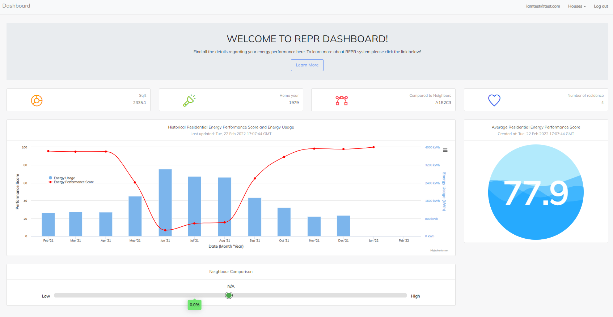

<p align="center">
  
</p>

# Residential Energy Performance Rating (REPR)
## Residential Energy Performance Scoring
### :question: What is Residential Energy Performance Score
Inspired by Energy Star's [Energy Performance Score](https://portfoliomanager.energystar.gov/pdf/reference/ENERGY%20STAR%20Score.pdf) for public and commercial buildings, our team developed the Residence Energy Performance Scoring, a 1-100 score providing a quantitative comparison between the energy efficiencies of residential homes.

The score aims to provide a benchmark based on similar house attributes and energy usages. The score is calculated by comparing the home's energy usage to its peers along with different statistical methods to provide a fair score regardless of any home or building-specific factors.

To present the usecase of the score system, our team developed Residential Energy Performance Rating System (REPR) which is a software application providing various features based on the score system.

### :heavy_plus_sign: How the 1-100 Score is calculated?
To calculate the 1-100 Energy Efficiency Score, we first compute energy usage intensity(EUI). EUI are calculated by dividing the annual energy usage by the total area of the building. Then, the score system estimates the annual energy usage based on different home factors, the area weathers, and the geographical regions. These factors are not considered to reflects on the "energy efficiency", however they impacts the energy usages of individual homes. To provide a fair score regardless of home types, we used following information to estimate the energy usage intensity and cluster home into peers. 
* The population/types of the city
* Types of home
* Square footage and number of rooms
* Years when built
* Weather conditions

The actual energy usage and estimated energy usages are compared to find energy efficiency ratio.
```
 Energy Efficiency Ratio = Actual EUI / Expected EUI
```
This ratio represent relative measure of how energy efficient the home is compared to expected energy usage.  When the ratio is high, then the home is more inefficient. The energy ratio is then compared with multiple peers that have similar home attributes by fitting a probability distribution. The peers are found using statistical clustering analysis. To view detail example, please see the [IPython notebook]().

### :open_file_folder: Data
To build tranditional 1-100 ENERGY STAR rating, [CBECS(US)](https://www.eia.gov/consumption/commercial/) and [SCIEU(Canada)](https://oee.nrcan.gc.ca/corporate/statistics/neud/dpa/menus/scieu/2014/tables.cfm) datasets were used. These data are from surveyed by government to understand energy usage in commerical and institutional buildings. Similarly, the government also did [RECS(US)](https://www.eia.gov/consumption/residential/) and [SECMURB(Canada)](https://oee.nrcan.gc.ca/corporate/statistics/neud/dpa/menus/murb/2018/tables.cfm) to samples energy usage in residential buildings. We performed analysis on RECS to build our score system

## Residential Energy Performance Rating (REPR)
The REPR is an web application developed to demonstrate different a usecase of the Residential Energy Performance Scoring system. The application includes dashboard for 
* Home owners to evaluates their home in terms of the energy efficiency and recommendations to improve the energy efficiency.
* Analyst who want to gain further insights on the driving factors of residential energy efficiency. 

> Main dashboard page


