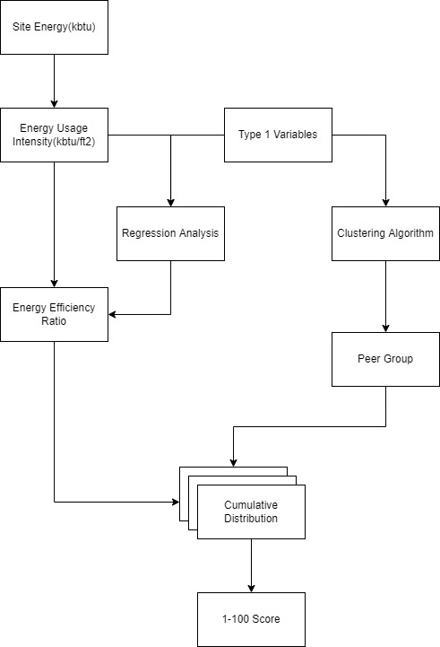
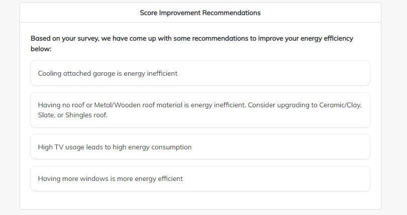
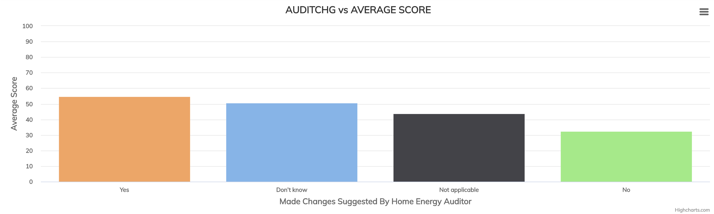
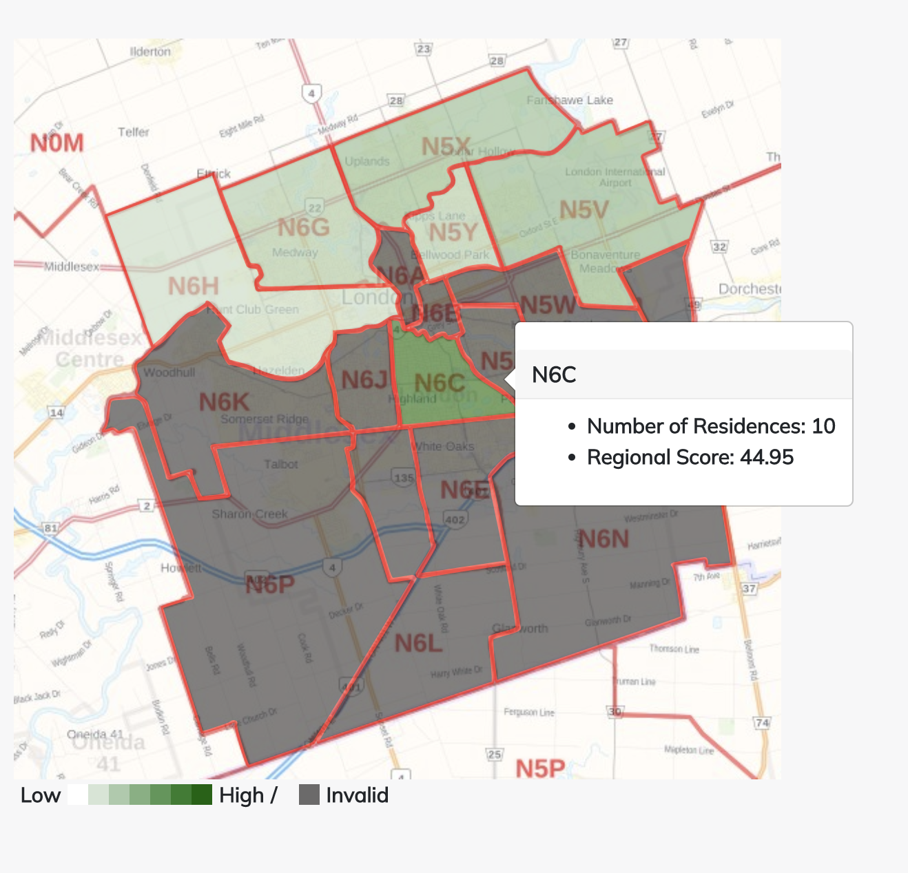
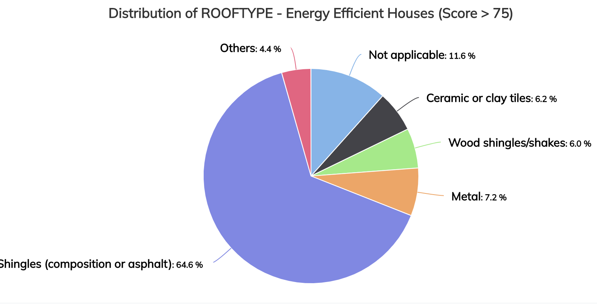
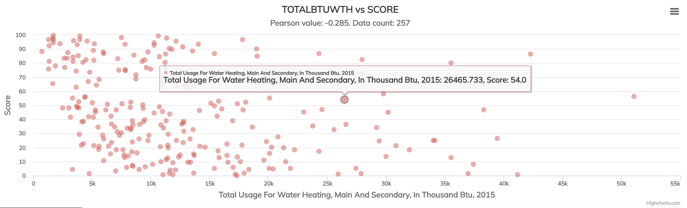

<p align="center">
  
</p>

# Residential Energy Performance Rating (REPR)
This is a public repository for our final year capstone project. The codebase and detailed analysis are in private repository. To contact, please reach out to one of our [members](misc/contact.txt). 

## Residential Energy Performance Scoring
### :question: What is Residential Energy Performance Score
Inspired by Energy Star's [Energy Performance Score](https://portfoliomanager.energystar.gov/pdf/reference/ENERGY%20STAR%20Score.pdf) for public and commercial buildings, our team developed the Residence Energy Performance Scoring, a 1-100 score providing a quantitative comparison between the energy efficiencies of residential homes.

The score aims to provide a benchmark based on similar house attributes and energy usages. The score is calculated by comparing the home's energy usage to its peers with statistical methods to provide a fair score regardless of home-specific factors.

To present use cases of the scoring system, our team developed Residential Energy Performance Rating System (REPR), a software application providing various features based on the scoring system.

### :heavy_plus_sign: How the 1-100 Score is calculated?
To calculate the 1-100 Energy Efficiency Score, we first compute __energy usage intensity(EUI)__. EUI is calculated by dividing the annual energy usage by the total area of the building. 

Then, the scoring system estimates the yearly energy usage based on different home factors, regional weather conditions, and metropolis information. These factors influence the energy usage of individual homes but should not reflect on the _energy efficiency_.  For convenience, we refer to these factors as __type 1 variables__ and any other factors that influence the energy efficiency as __type 2 variables__. Examples of type 1 variables include,
* The population/types of the city
* Types of home
* Square footage and number of rooms
* Years when built
* Weather conditions

The scoring system also uses the type 1 variables to select peers comparison to provide a fair score regardless of home types or geographical location.

The estimated energy usages are used to calculate the __energy efficiency ratio__ with the actual energy usage. 
```
 Energy Efficiency Ratio = Actual EUI / Expected EUI
```
This ratio represents the relative measure of how energy-efficient the home is by comparing the actual energy usage to expected energy usage given different building or geographical factors discussed above(type 1). When the ratio is high, the residence building is less energy efficient, and vice versa. 

The energy efficiency ratio is compared with multiple peers with similar home attributes by fitting a probability distribution. Scaling the cumulative probability from the fitted distribution provides a score between 1-100, where 100 represents the home is the most energy-efficient among its peers. The peers are found using statistical clustering analysis with the type 1 variables. To view detail example of how to calculate the score, please see the [IPython notebook](https://github.com/jsong336/REPR-README/blob/first-write-up/Residential_Energy_Performance_Scoring.ipynb).

```
    Score = (1 - CDF(Energy Efficiency Ratio)) x 100 
```

__Overview of Scoring System__
<p align='center'>
  
</p>

### :open_file_folder: Data
To build tranditional 1-100 ENERGY STAR rating, [CBECS(US)](https://www.eia.gov/consumption/commercial/) and [SCIEU(Canada)](https://oee.nrcan.gc.ca/corporate/statistics/neud/dpa/menus/scieu/2014/tables.cfm) datasets were used. These data are from government surveys to understand energy usage in commercial and institutional buildings. Similarly, the government also did [RECS(US)](https://www.eia.gov/consumption/residential/) and [SECMURB(Canada)](https://oee.nrcan.gc.ca/corporate/statistics/neud/dpa/menus/murb/2018/tables.cfm) to sample energy usage in residential buildings. We performed analysis on RECS to build our score system

## Residential Energy Performance Rating (REPR)
The REPR is a web application developed to demonstrate different use-cases of the Residential Energy Performance Scoring system. The application includes a dashboard for 
* __Homeowners__ who want to evaluate the energy efficiency of their home and receive general recommendations to improve the score. 
* __Analysts__ want to gain further insights into the driving factors of residential energy efficiency. 

### Homeowner User Dashboard
The features for typical homeowners who want to know their home's energy efficiency could use the REPR user dashboard to create __Residence Portfolio__ to view annual energy efficiency scores and monthly projected scores. 

<p align="center">
  
</p

Furthermore, the user could fill out a quick survey to receive simple recommendations which might help the user improve the energy efficiency of the user's home, which analysts could generate based on the score.

<p align="center">
  
</p>

### Analytic Dashboard 
If advanced users want to see more detail analytics based on the score, the REPR analytic dashboard demonstrate use case of the score system to analyzes data and different factors (type 2). The analytic dashboard provides following visualizations.  
  
#### Average Score By House Attribute
To understand average score over a house attribute, the advanced user could look at the bar chart which group the score average by different home attribute values.
<p align="center">
  
</p>

#### Regional Score Heatmap 
To understand the average score across the geographical region, the advanced user could look at the heatmap which shows average score over different section in a city. 
<p align="center">
  
</p>

#### Pie Chart for Energy Efficient Residences
To understand what attributes contributes to energy efficiency, the advanced user could view the piechart which shows percentage different values for homes with score >=75 which are considered energy efficient homes. 
<p align="center">
  
</p>

#### Sample Scatter Plot On Score
To view correlation between a continous variables and the score, the advanced user could look at the sample scatter plot along with the correlation between home attributes and the score. 
<p align='center'>
  
</p>
